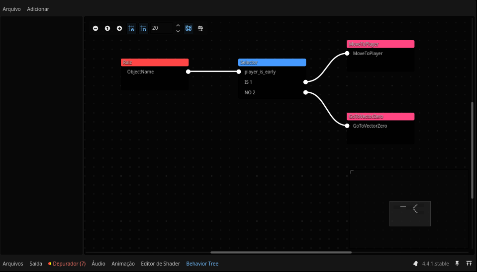
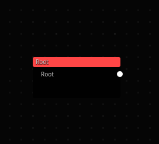
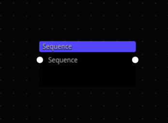
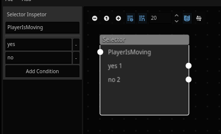
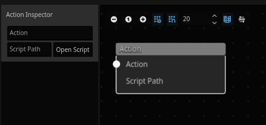

# Behavior-Tree-Editor
A behavior tree editor based on GraphNodes.



**BehaviorTreeEditor** is a plugin for Godot Engine that allows you to create Behavior Trees visually. It’s ideal for complex AIs with many behaviors.

Please note: the plugin may still contain bugs and inconsistencies.

# Features
- Visual interface for creating Behavior Trees.
- Available Nodes:
    - Root: Starts the behavior tree
    - Selector: Selects a node based on a condition
    - Sequence: Executes a sequence of nodes (Still under development)
    - Action: Node used to define the CharacterBody's action

# Installation

1. Copy the plugin folder `addons/BehaviorTreeEditor` into the `addons/` folder of your Godot project.
2. Go to `Project > Project Settings > Plugins` and enable the plugin.

# How to Use

After opening or creating a new file, a new option will appear in the toolbar. Clicking it will show you the list of nodes available in the plugin. Below is a step-by-step guide for each node.

## Root
  
Essential for starting the behavior tree.

**Notes:** It has not yet been tested whether it’s possible to start multiple trees with different root nodes in a single file.

## Sequence
  
All nodes connected to the Sequence will be executed in order.

**Notes:** Still incomplete. The sequence currently causes an infinite loop with connected nodes. Using it in a live project may cause crashes. Please wait for future updates.

## Selector
  
Using the Selector, you can execute a node based on a condition.

**Notes:** This node includes its own interface to assist with setup.

## Action
  
Finally, the Action node. It is responsible for assigning the script that defines the action of your CharacterBody.

**Notes:** This node also includes its own interface.

#

After completing your behavior tree, add the **BehaviorTreeExecuter** node to your character’s scene tree. This node allows you to assign the CharacterBody and the behavior file.

To make usage even easier, a class **BehaviorTreeActionScript** was created, so you can access the required plugin resources.

## Example of an Action Script
```gdscript
extends BehaviorTreeActionScript

func execute() -> int:
	var node_owner:CharacterBody3D = get_behavior_tree_owner()
	var player_ref:obj_player = node_owner.player_ref
	
	if player_ref:
		var direction = node_owner.global_position.direction_to(player_ref.position)
		if direction != Vector3.ZERO:
			node_owner.velocity = direction * 2.0
		
	return finish_success()
```

# Tutorials

We currently don’t have official tutorials. If you create one, please open an issue with the documentation label and share your video link so we can add it here. Tutorials in any language are welcome.